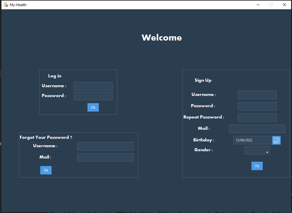
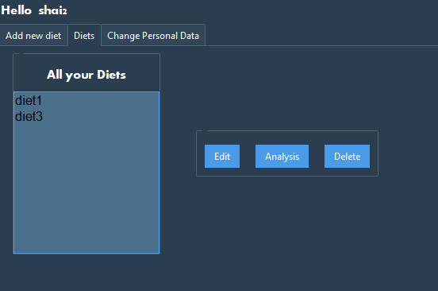
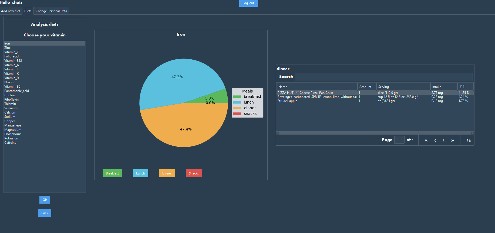

# My-Health
## Description
My-health is a program created to help people calculate their daily vitamin intake and compare it to the optimal amount according to USDA data.
Users can save multiple diets and edit them, the diets are saved in a MongoDB database that allowed the developer a clear display of all the user’s information.

## How to Install and Run the Project

1.	Download MongoDB in this link : https://www.mongodb.com/try/download/community  
in MongoDB create a new Database named Main_Database and a new collection named Users. 
2.	Install all the necessary libraries from the requirements.txt 
3.	 In order to use the ‘Forgot Your Password’ feature add your mail data to SENDER_PASSWORD and SENDER_MAIL in consts.py 
4.	You should get API KEY from USDA : https://fdc.nal.usda.gov/api-key-signup.html  
and add the key to key_from_USDA in consts.py
5. Run the program in cmd : python ./start_app.py

## Usage 
You should sign up or login in welcome page:  
    

Add food to your diet:  
 
after adding all the foods in your diet ,enter diet name and click ‘Add new diet’.  

‘Diet’ tab:  
  

  
You have 3 functions in this tab:
Edit – you can edit the chosen diet (add new food or delete food similar to "Add new diet" tab) 
Delete  - delete the chosen diet 
Analysis -  View vitamin values for each vitamin:  
   
